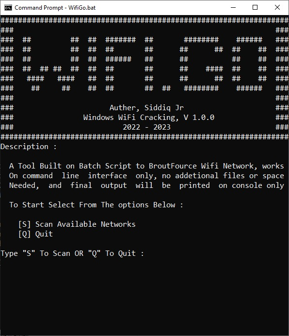
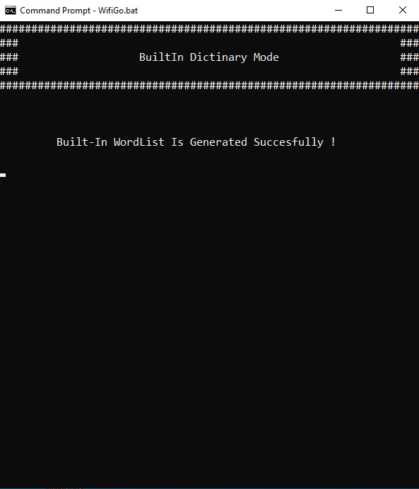

Description:

WiFiGo is a Windows Biased Wi-Fi Cracking Tool, Built with Batch Scripting only and Upon The netsh Batch Scrip which is built-in every windows machine.

Operation:

The Tool Creates a temporary Profile Using a network selected by the user and add it to "User Profiles” and then connect to it, then test if the adapter actually connected with   the   correct   settings, after  that determine if  to continue searching for new word or to  remain the connected  Network biased on connections status, Finally it Prints the right settings on screen and exit.

Installation:

It's a batch script So there is no actual installation, But To work Correctly please review the requirements.

Requirements:

  * Windows Operation System, Preferably (Win10/Win11).
  * All Environmental variables are set as defaults, "PATH" Environmental
    variable
    Could have more than one value.
  * Any Wireless Network Adapter.
  * A Wireless Network Close and Has a Good Signal.
  * The Network Must Be Available Throughout the Cracking Process.

Usage:
    First: 
        Best Practice it to Open Command Prompt and Locate the Batch file and
        then Run it.
        Ctrl + X => Select Command Prompt => cd Desktop\WiFiGo\wifigo.bat
        Or Can Doable Click on the Batch File Directly. 

    Second: 
        Scan or Quit, select [S] To scan for available Networks, then Select a Cracking Method User Provided Dictionary (Wordlist) OR Built-in Dictionary, then 
        
            Case one: Built-in Dictionary:
                It Will Generate a Dictionary and Start Attacking the Selected Network. and after it found the correct password will offer to save it to a txt file on desktop.  
                or if there is no correct password it will tell you that and exit. 

            Case two: User Provided Dictionary: 
                It Will Ask for a Correct Path to the txt File Containing the Words, if the path Contains space Surround it with Double Quotes, Ex:
                        ( "C:\Users\Siddiq Jr\Desktop\Wordlist.txt" )
                Batch Now Will Verify the File and File Path and start cracking and also offer the correct password if found else it will tell you that and exit. 
  
    The Quit Option is Self-explanatory. [Q].

    Screen Shots :

            
    
    Options are Start Scanning by Typing "S" 
    Or Quitting By Typing "Q"

    Here Just Copy the Network that you whant by highliting it and Ctrl+C and
    pasteing it by clicking the right mouse butten or Ctrl+V

    Select from a Built-in Yet Very Week File Of Wordlist by Typing "1"
    or inport you own wordlist by typing "2"
    or to quit from this point.

    In the Built-in Wordlist This Screen Will Confirm Wordlist Generation
    otherwise it will exit and it will be a bug !!.

    In The custom Wordlist you will have to provide the path to it and if the 
    path hase spaces in it must be Surrounded by double quotes as shown

    This Screen Will Confirme the Wordlist validation if correct or not 
    if not it will tell you that and exit

    Here the attack starter for any of the options (Built-in/Custom) and will
    show the password its testing dinamicly. 

    Here the Script is over and success getting the password, it will offer to save it as a txt file,
    sorry i've covered the password because its my real password (LOL) "WeekPassword" :)

                      That's It you'r good to Go,  Enjoy!

Follow Me to Get an Official Release and For the Next Version of This and Other Scripts.

ON YouTube Find a Usage Tutorial and Build Tutorial for This Tool and Others.

YouTube:
https://www.youtube.com/channel/UCS99vn-SuSWUYmVorppAKfg

GitHub:
https://github.com/siddiq-jr/